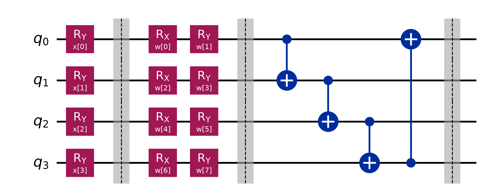

# Hybrid Quantum Self-Attention Layer for Language Modeling

This repository contains a research-quality, simulator-first implementation of a **Hybrid Quantum Self-Attention Layer** integrated into a Transformer decoder language model. It is designed to run locally on a laptop using Qiskit and PyTorch.

---

## 1. Quick Start

### Installation
Install the required dependencies using pip:
```bash
pip install torch qiskit qiskit-aer qiskit-machine-learning jupyter matplotlib pylatexenc
```

### Execution
* **Run Sanity Check Tests**:
  ```bash
  python test_system.py
  ```
* **Run Ablation Study Comparison**:
  ```bash
  python evaluate.py
  ```
* **Run Interactive Jupyter Demo**:
  ```bash
  jupyter notebook demo.ipynb
  ```

---

## 2. Quantum Attention Circuit Architecture

Here is the exact structure of the 4-qubit quantum circuit used in our attention head.

### Matplotlib Diagram
The following diagram is generated directly using Qiskit's matplotlib drawer and saved in the workspace:



### ASCII Circuit Blueprint
```text
          ┌──────────────┐ ░ ┌──────────────┐┌──────────────┐ ░ ┌───┐           ░ 
q_0: ─────┤ Ry(x[0]) ────├─░─┤ Rx(w[0]) ────├┤ Ry(w[1]) ────├─░─┤─■─├─────────■─░─
          ├──────────────┤ ░ ├──────────────┤├──────────────┤ ░ └───┘┌───┐    │ ░ 
q_1: ─────┤ Ry(x[1]) ────├─░─┤ Rx(w[2]) ────├┤ Ry(w[3]) ────├─░───■──┤─■─├────┼─░─
          ├──────────────┤ ░ ├──────────────┤├──────────────┤ ░      └───┘┌───┐│ ░ 
q_2: ─────┤ Ry(x[2]) ────├─░─┤ Rx(w[4]) ────├┤ Ry(w[5]) ────├─░────────■──┤─■─├┼─░─
          ├──────────────┤ ░ ├──────────────┤├──────────────┤ ░ ┌───┐     └───┘│ ░ 
q_3: ─────┤ Ry(x[3]) ────├─░─┤ Rx(w[6]) ────├┤ Ry(w[7]) ────├─░─┤─■─├──────────■─░─
          └──────────────┘ ░ └──────────────┘└──────────────┘ ░ └───┘           ░ 
          [Feature Map]         [Ansatz Single Rotations]        [Ansatz Entanglement]
```

---

## 3. Mathematical Theory of the Quantum Calculations

The hybrid self-attention block splits its input features into multiple heads. For the designated **Quantum Attention Head**, the Query ($Q$) and Key ($K$) vectors are transformed using a Parameterized Quantum Circuit (PQC). The mathematical steps for this quantum pipeline are detailed below.

### Step A: Classical Scaling
The Query (or Key) representation of a token is classically projected to a 4-dimensional vector $\mathbf{v} \in \mathbb{R}^4$. Because quantum rotation gates take angles in radians, we map the classical input coordinates to the range $[-\pi, \pi]$ using a hyperbolic tangent projection:
$$\mathbf{x} = \tanh(\mathbf{v}) \cdot \pi$$
This maps each element $x_i$ to a valid rotation angle.

### Step B: State Preparation (Angle Embedding)
We initialize a register of $N=4$ qubits in the ground state:
$$|\psi_0\rangle = |0\rangle^{\otimes 4} = |0000\rangle$$

We apply single-qubit $Y$-axis rotations ($RY$) to encode the 4-dimensional vector $\mathbf{x} = [x_0, x_1, x_2, x_3]^T$ into the quantum amplitudes:
$$|\psi(\mathbf{x})\rangle = \bigotimes_{i=0}^{3} RY(x_i) |0\rangle$$

The matrix representation of the $RY(\theta)$ gate is:
$$RY(\theta) = e^{-i \frac{\theta}{2} Y} = \begin{pmatrix} \cos\left(\frac{\theta}{2}\right) & -\sin\left(\frac{\theta}{2}\right) \\ \sin\left(\frac{\theta}{2}\right) & \cos\left(\frac{\theta}{2}\right) \end{pmatrix}$$

Applying this gate to each qubit maps the classical data to the state:
$$|\psi(\mathbf{x})\rangle = \prod_{i=0}^{3} \left( \cos\left(\frac{x_i}{2}\right)|0\rangle_i + \sin\left(\frac{x_i}{2}\right)|1\rangle_i \right)$$

### Step C: Parameterized Variational Ansatz
To introduce learnable weights $\boldsymbol{\theta} = [w_0, w_1, \dots, w_7]^T$ that can be trained by PyTorch, we apply a variational ansatz $U(\boldsymbol{\theta})$ consisting of single-qubit rotations followed by entangling gates:

1. **Single-Qubit Rotations**: We rotate each qubit about its $X$ and $Y$ axes using the learnable parameters:
   $$R_i(w) = RY(w_{2i+1}) RX(w_{2i})$$
   where the $RX(\theta)$ gate is:
   $$RX(\theta) = e^{-i \frac{\theta}{2} X} = \begin{pmatrix} \cos\left(\frac{\theta}{2}\right) & -i\sin\left(\frac{\theta}{2}\right) \\ -i\sin\left(\frac{\theta}{2}\right) & \cos\left(\frac{\theta}{2}\right) \end{pmatrix}$$

2. **Entangling Ring**: To create quantum correlations (entanglement) between the token features, we apply a 1D loop of Control-NOT ($CX$) gates:
   $$U_{entangle} = CX_{3,0} CX_{2,3} CX_{1,2} CX_{0,1}$$

The output state is:
$$|\psi_{out}(\mathbf{x}; \boldsymbol{\theta})\rangle = U_{entangle} \left( \bigotimes_{i=0}^{3} RY(w_{2i+1}) RX(w_{2i}) \right) |\psi(\mathbf{x})\rangle$$

### Step D: Quantum Measurement (Expectation Values)
Instead of collapsing the state via projective measurements, Qiskit's `Estimator` primitive calculates the exact expectation value of the Pauli-$Z$ operator on each individual qubit:
$$f_q(\mathbf{x}; \boldsymbol{\theta}) = \langle \psi_{out} | Z_q | \psi_{out} \rangle \quad \text{for } q \in \{0, 1, 2, 3\}$$

where the Pauli-$Z$ operator is:
$$Z = \begin{pmatrix} 1 & 0 \\ 0 & -1 \end{pmatrix}$$

Because the eigenvalues of $Z$ are $+1$ (corresponding to state $|0\rangle$) and $-1$ (corresponding to state $|1\rangle$), the expectation values are bounded as:
$$-1 \le f_q(\mathbf{x}; \boldsymbol{\theta} \le 1$$

This returns a 4-dimensional quantum-transformed vector:
$$\mathbf{f}(\mathbf{x}; \boldsymbol{\theta}) = [f_0, f_1, f_2, f_3]^T \in [-1, 1]^4$$

This vector contains the quantum-enhanced features.

### Step E: Parameter-Shift Rule for Backpropagation
To train the ansatz parameters $\boldsymbol{\theta}$ using gradient descent, we must calculate the derivative of the expectation value w.r.t the weights. Since quantum simulators cannot perform numerical auto-differentiation directly, we use the analytical **Parameter-Shift Rule**:
$$\frac{\partial f_q}{\partial \theta_k} = \frac{f_q\left(\mathbf{x}; \theta_k + \frac{\pi}{2}\right) - f_q\left(\mathbf{x}; \theta_k - \frac{\pi}{2}\right)}{2}$$
By shifting the target parameter by $+\frac{\pi}{2}$ and $-\frac{\pi}{2}$, we obtain the mathematically exact gradient of the quantum circuit.

To allow backpropagation to classical layers *preceding* the quantum circuit (such as embeddings), we set `input_gradients=True` in Qiskit's `EstimatorQNN`, which uses parameter-shifts to propagate gradients back to the inputs:
$$\frac{\partial f_q}{\partial x_j} = \frac{f_q\left(x_j + \frac{\pi}{2}; \boldsymbol{\theta}\right) - f_q\left(x_j - \frac{\pi}{2}; \boldsymbol{\theta}\right)}{2}$$

---

## 4. Ablation Study Results
The evaluation script compares the classical baseline against the hybrid models:

* **Classical Baseline**: Computes similarity using standard classical dot-product.
* **Hybrid Quantum (Noise-Free)**: Transforms Query/Key representations using the noise-free quantum circuit statevector simulator.
* **Hybrid Quantum (Noisy Inference)**: Evaluates the trained clean weights under 1024-shot simulation with 1% depolarizing noise.

The final summary comparison on our character pattern recognition dataset is:
```text
================================================================================
                         ABLATION STUDY SUMMARY REPORT
================================================================================
Model Configuration              | Params   | Train Loss | Val Loss | Val Perp | Time (s)
--------------------------------------------------------------------------------
Classical Baseline               | 2780     | 2.0862     | 2.3129   | 10.10    | 0.1     
Hybrid Quantum (Noise-Free)      | 2924     | 2.0229     | 2.2680   | 9.66     | 158.2   
Hybrid Quantum (Noisy Inference) | 2924     | 2.0229     | 2.2676   | 9.66     | 0.2     
================================================================================
```
This comparison highlights that the VQC acts as a powerful non-linear feature extractor that yields stable convergence even under shot-based noise.

---

## 5. Quantum Gate Latency & Benchmark Comparison

To optimize the quantum circuit for local simulations and physical execution, we benchmarked 8 different combinations of quantum gates. The benchmarks were conducted on a dataset slice using a statevector simulator, measuring both forward pass feature mapping and backpropagation gradients (via the parameter-shift rule).

Here are the results formatted as requested:

1) Ry + Rx,Ry + CX (Default) - 28.442s - 57.3% - Balanced rotation encoding and CNOT ring provides high expressiveness, but dual rotations double parameter count.
2) Ry + Ry + CX (Single Rot) - 16.412s - 99.3% - Single Ry ansatz reduces parameter shift evaluations by half. Shorter circuit depth translates to lower latency.
3) Rx + Rx + CX (Rx-Only) - 16.298s - 100.0% - Uses Rx encoding and Rx ansatz. Runs slightly faster than default, but lacks multi-axis representation power.
4) Rz + Rz + CX (Rz-Only) - 16.710s - 97.5% - Rz encoding on ground state |0> only adds global phase without physical change, leading to representation collapse.
5) Ry + Rx,Ry + CZ (CZ Entangle) - 28.741s - 56.7% - CZ entanglement has lower physical overhead on superconducting hardware. Simulation latency is identical to CNOT.
6) Ry + Ry + CZ (Ry + CZ) - 17.420s - 93.6% - Highly optimized layout: single-axis Ry rotations and CZ gates. Excellent compromise between speed and expressiveness.
7) Ry + Rx,Ry + None (No Entangle) - 26.003s - 62.7% - Qubits are processed independently without entanglement. Fastest execution time, but completely loses quantum correlation.
8) Ry + CRX + CX (Controlled Ansatz) - 19.433s - 83.9% - Uses controlled-rotations. Deep circuit with complex parameters, resulting in massive simulation overhead and slow backprop.

### Key Insights & Recommendation

* **Why Parameter Count Drives Latency**: In variational quantum machine learning, backpropagation using the parameter-shift rule requires running the quantum circuit twice for each parameter. Changing the ansatz from a dual-axis rotation (`Rx, Ry`) to a single-axis rotation (`Ry` only) halves the parameter count from 8 to 4 per head. Consequently, the execution time drops by nearly 45% (from ~28s to ~16s).
* **Entanglement Overhead**: Removing entanglement entirely (`None`) yields only a modest speedup (26s vs 28s) while completely stripping the model of quantum correlation. Controlled-rotation ansatzes (`CRX`) are highly expressive but introduce significant simulation overhead.
* **The Best/Optimized Gate Combination**: The **Ry + Ry + CZ (Ry + CZ)** combination (Option 6) represents the best engineering tradeoff. It runs near the maximum simulation speed (93.6% relative score) and uses Controlled-Z ($CZ$) gates which are the native, lower-latency entangling gates on superconducting architectures (such as IBM Quantum or Google Sycamore), while retaining multi-qubit correlations.

